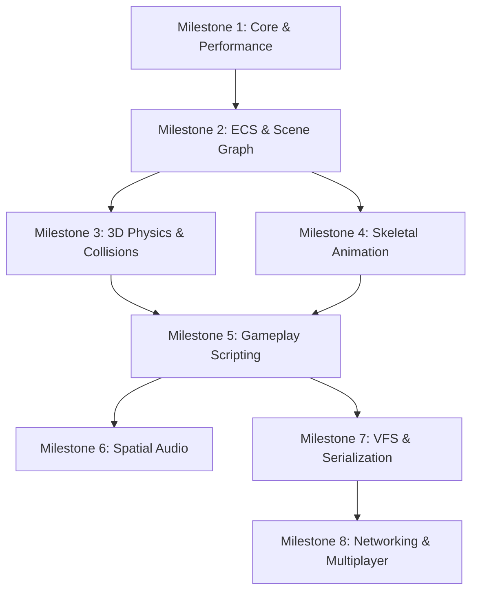

# Arc Engine Systems Roadmap: Core & Advanced Systems Architecture

This roadmap outlines the transition of **Arc Engine** from a rendering-focused framework to an intermediate/advanced game engine. Having completed the graphics and post-processing foundations, the engine's focus now shifts toward performance, modular architecture, gameplay systems, and robust core sub-systems.

---

## Current Engine Foundation

- **Core & OS**: SDL2 windowing, input polling, high-precision hybrid frame-rate limiter.
- **Graphics & Shading**: BGFX renderer with Vulkan backend, full PBR materials (Albedo, Normal, Metallic-Roughness, AO, Emissive).
- **Lighting & Shadows**: 4-Cascade Shadow Maps (CSM) with rotated Poisson Disk PCF and slope-biased stabilization.
- **Post-Processing**: HDR framebuffer with dual-filtering bloom, tonemapping, and gamma correction.
- **Asset Pipeline**: glTF/GLB model loader (`cgltf`) and texture caches.

---

## Systems Roadmap (Intermediate / Advanced)

### Milestone 1: Core Architecture, Profiling & Diagnostics
*Goal: Establish high-performance foundations, memory tracking, and profiling tools.*
- **Custom Memory Allocators**:
  - Implement linear/arena, stack, and pool allocators to minimize runtime heap allocation (`malloc`/`new`).
  - Introduce a frame allocator for transient data that automatically resets at the end of each frame.
- **Tracy Profiler Integration**:
  - Integrate Tracy for deep instrumented profiling (CPU zones, memory allocations, GPU timing).
- **Quake-Style Command Console (CVars)**:
  - Add a runtime command console and Console Variables (CVars) system.
  - Allow tweaking engine settings (e.g., gravity, game speed, profiling flags) and executing commands at runtime.

### Milestone 2: Entity Component System (ECS) & Scene Graph
*Goal: Replace the flat SceneObject array with a data-oriented architectural pattern.*
- **ECS Integration (EnTT)**:
  - Integrate `EnTT` (or design a lightweight custom ECS) to separate data (components) from logic (systems).
  - Common components: `TransformComponent`, `MeshComponent`, `LightComponent`, `RigidbodyComponent`, `CameraComponent`.
- **Hierarchical Scene Graph**:
  - Implement a scene graph that supports parent-child relationships.
  - Correctly propagate local transforms down to global transforms (e.g., local position shifts when a parent moves).
- **System Separation**:
  - Standardize engine loops into systems: `InputSystem`, `PhysicsSystem`, `ScriptSystem`, `AudioSystem`, `RenderSystem`.

### Milestone 3: 3D Physics & Rigid Body Dynamics
*Goal: Move from basic collision checks to a complete rigid body simulation.*
- **Physics Engine Integration (Jolt Physics / PhysX)**:
  - Integrate a modern 3D physics library like **Jolt Physics** (recommended) or **PhysX**.
- **Rigid Body Components**:
  - Define dynamic, static, and kinematic rigid body types.
  - Support physical properties like mass, friction, restitution, linear/angular velocity, and gravity scale.
- **Colliders**:
  - Implement box, sphere, capsule, and convex hull/mesh colliders.
- **Queries & Triggers**:
  - Expose raycasting, sphere sweep tests, and trigger volume overlap callbacks (e.g., `OnTriggerEnter`/`OnTriggerExit`).

### Milestone 4: Skeletal Animation & Vertex Skinning
*Goal: Implement character animations and skinning.*
- **Skeletal glTF Loading**:
  - Parse joints, bone hierarchies, bind poses, and inverse bind matrices using `cgltf`.
- **Animation Blending**:
  - Read keyframed translation, rotation (quaternions), and scale animation tracks.
  - Implement linear interpolation (LERP) and spherical linear interpolation (SLERP) to blend between animation clips.
- **GPU Skinning**:
  - Pass bone transform matrices to the vertex shader.
  - Perform vertex skinning on the GPU to deform meshes based on joint weights (up to 4 bones per vertex).

### Milestone 5: Gameplay Scripting & Hot-Reloading
*Goal: Enable rapid gameplay iteration without recompiling the C++ engine.*
- **Lua Scripting Integration (sol2)**:
  - Embed Lua into the engine, using `sol2` for modern C++ bindings.
- **Engine API Bindings**:
  - Bind math structures (`Vector3`, `Quaternion`), input, ECS entity manipulation, and physics queries to Lua.
- **Script Component**:
  - Implement a script component containing lifecycles like `OnCreate()`, `OnUpdate(dt)`, and `OnCollision()`.
- **Runtime Hot-Reloading**:
  - Monitor script file modifications and reload Lua files dynamically at runtime without restarting the game.

### Milestone 6: Spatial Audio System
*Goal: Add immersive 3D sound capabilities.*
- **Audio Library Integration (SoLoud / OpenAL)**:
  - Integrate **SoLoud** or **OpenAL Soft** for low-latency audio processing.
- **3D Sound Panning & Attenuation**:
  - Implement an audio listener component on the main camera.
  - Implement 3D audio emitter components with volume roll-off/distance attenuation and Doppler effects.
- **Audio Routing**:
  - Support sound categories (Music, SFX, Dialogue) with master/bus volume controls.

### Milestone 7: Virtual File System (VFS) & Asset Packaging
*Goal: Abstract resource loading and optimize assets for shipping.*
- **Virtual File System (VFS)**:
  - Abstract path resolution (e.g., mount folders to paths like `assets://textures/`).
- **Asset Serialization & PAK files**:
  - Support packing game assets into single archive files (`.pak`) with compression (using `zstd` or `lz4`).
- **Asynchronous Loading**:
  - Offload asset loading, decompression, and parsing to the job system to prevent game stutter during runtime loading.

### Milestone 8: Networking & Multiplayer (Client-Server)
*Goal: Support multiplayer gameplay loops.*
- **UDP Network Library (ENet / yojimbo)**:
  - Integrate a reliable UDP library for networking.
- **State Replication**:
  - Replicate ECS component data (e.g., positions, velocities) from the server to client copies.
- **Client-Side Prediction**:
  - Implement simple local client prediction for movement to hide network latency, with server reconciliation.
